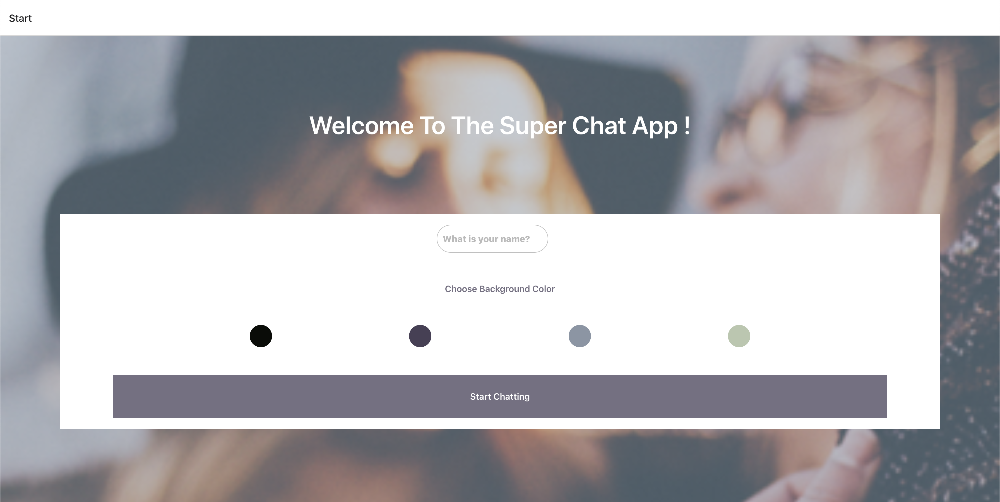

# React Native Chat App

## Description

The aim of this project is to build a chat app for mobile devices using React Native. The app will provide users with a chat interface and options to share images and their location.

## Technologies used:
- React Native
- Expo
- Google Firebase
- Gifted Chat

## Key Features
- A page where users can enter their name and choose a background color for the chat screen before joining the chat.
- A page displaying the conversation, as well as an input field and submit button.
- The chat must provide users with two additional communication features: sending images and location data.
- Data gets stored online and offline.

## Installation Prerequisites
- Node.js and npm
- Android Studio or Xcode for iOS
- Expo / Expo Go

## Setup

- Download this repo.
- In your CLI, navigate to the root directory of the project.
- Run npm install to install all the dependencies.
- Run npm start or expo start in terminal to start local server
- Install Expo Go on a smartphone or use an emulator (Android Studio) to start the app trough Expo

## WHAT IT LOOKS LIKE

